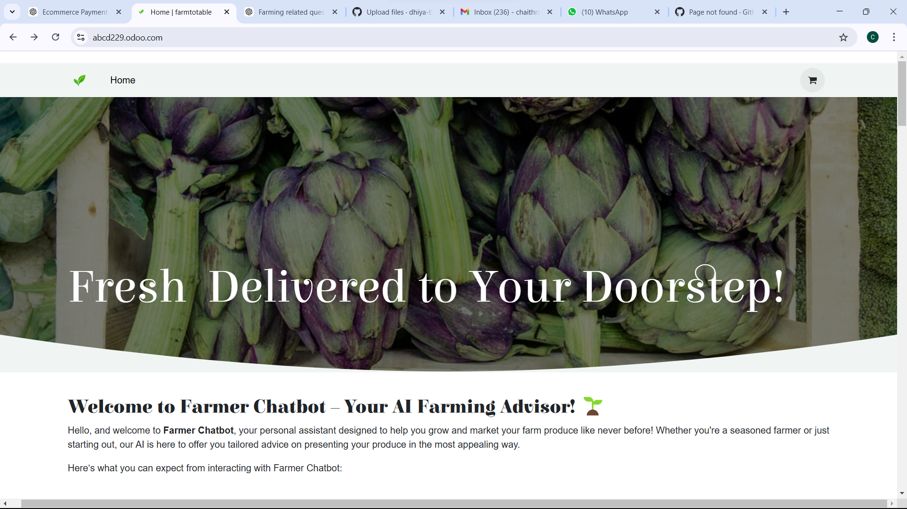
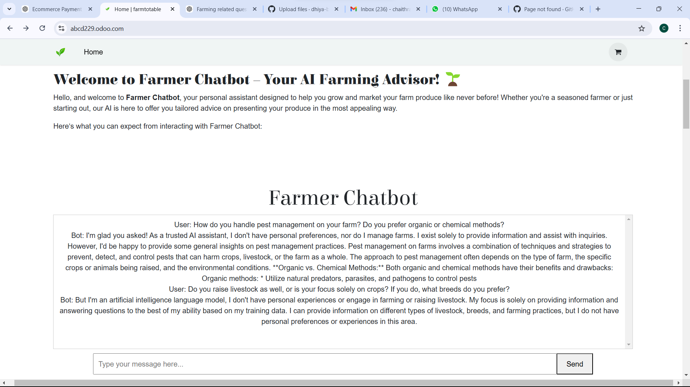
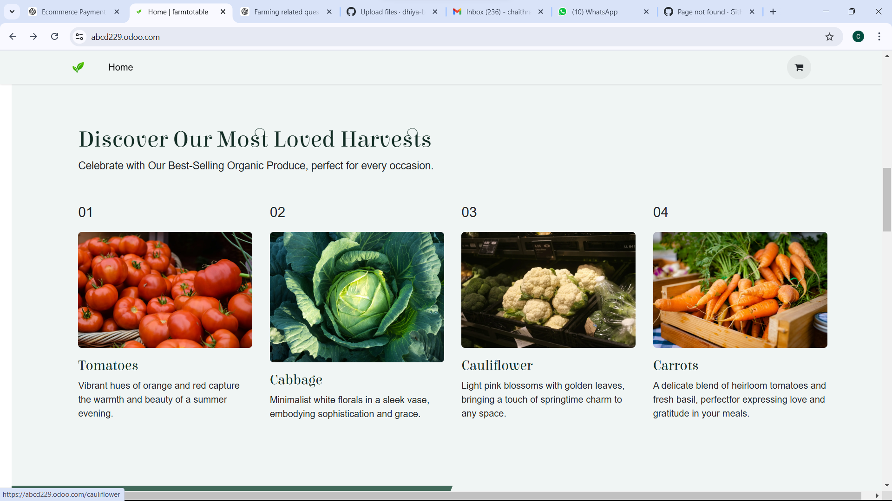

# [Project Name] 🎯Farm to Table


## Basic Details
### Team Name: [Codespires]


### Team Members
- Member 1: [Chaithra Manoj] - [sahrdaya collage of engineering and technology]
- Member 2: [Dhiya Binoy] - [sahrdaya collage of engineering and technology]
- Member 3: [Ann Grace Justin]-[sahrdaya collage of engineering and technology]

### Hosted Project Link
[mention your project hosted project link here](https://abcd229.odoo.com/)

### Project Description
Farm to Table: Connecting Fresh, Local Produce with Consumers

Farm to Table is an innovative e-commerce platform that bridges the gap between local farmers and consumers, 
making it easier than ever to purchase fresh, high-quality produce directly from the source. Our website offers a seamless shopping experience,
allowing users to browse a variety of fresh fruits, vegetables, meats, dairy, and artisanal products, all grown or crafted by local farmers.
By supporting sustainable farming practices, we aim to provide healthier food options
while empowering small-scale farmers and fostering a direct relationship between the farm and the table.

### The Problem statement
Problem Statement:

Consumers today are increasingly seeking fresh, locally-sourced produce, but often face challenges in finding reliable platforms that connect them directly with local farmers. Many existing e-commerce platforms lack transparency, making it difficult for customers to verify the quality, sustainability, or origin of their food. Additionally, farmers struggle to reach a broader customer base and often face inefficiencies in managing inventory, pricing, and demand.

Our solution is an AI-powered Farm to Table e-commerce platform that not only provides consumers with easy access to fresh, high-quality, locally-grown produce but also enhances the buying experience through personalized recommendations, dynamic pricing, and optimized inventory management. By leveraging AI to predict demand, streamline logistics, and match customers with the right products, we aim to create a more sustainable, transparent, and efficient food system that benefits both consumers and farmers alike.

### The Solution
"Farm to Table is an innovative e-commerce platform that connects consumers directly with local farmers, offering fresh, sustainable produce right at their fingertips. Our platform leverages AI to enhance the shopping experience in a variety of ways.

With personalized recommendations powered by AI, users can easily discover products tailored to their preferences, dietary needs, or seasonal availability. Additionally, our integrated AI chatbot provides 24/7 assistance, guiding customers through product selection, answering questions about freshness and origin, and even helping with the checkout process.

The AI also works behind the scenes to optimize inventory management, predict demand trends, and ensure dynamic pricing, all of which ensure that both consumers and farmers can rely on the platform for efficiency, transparency, and convenience. Whether you're a consumer seeking fresh produce or a farmer looking to expand your market reach, Farm to Table simplifies the process with cutting-edge AI technology.

## Technical Details
### Technologies/Components Used
For Software:
- Javascript
- Html
- Php
- Python

For Hardware:
- Off site server 
- No additiona hardware

### Implementation
For Software:
# Installation
For installing the code just clone the repo and run the commnds or open up the html file

# Run
```
# either use a nginix or other such hosting platform
or use odoo for hosting the platform
```

### Project Documentation
For Software:
1. Frontend Technologies:
HTML/CSS: For building the structure and design of the website.
JavaScript (React.js or Vue.js): For creating a dynamic, interactive, and responsive user interface.
Bootstrap/Tailwind CSS: For quick and flexible UI design.
2. Backend Technologies:
Node.js: To build a scalable backend for handling server-side logic and API requests.
Express.js: A Node.js framework to simplify API routing and server configuration.
Python (Flask/Django): If you need Python for any AI/ML processes or data manipulation.
3. Database:
MongoDB (NoSQL): To store product details, customer data, orders, and other dynamic content.
PostgreSQL (SQL): For structured data and relationships, such as customer profiles and transaction history.
Redis: For caching frequently accessed data like popular products or user sessions.
4. AI Chatbot (Groq API for LLM):
Groq API: To power the large language model (LLM) chatbot for providing intelligent, conversational assistance to users. The Groq API can be used to handle user queries about products, order status, and farm-to-table processes.
Natural Language Processing (NLP): Libraries like spaCy or Hugging Face Transformers (if additional customization is required) can be used to fine-tune the AI for specific tasks.
Dialogflow or Rasa (optional): If you need extra control over the chatbot's conversational design before integrating with Groq’s API.
5. Payment Gateway Integration:
Stripe or PayPal: For secure online payment processing.
Razorpay (for India): As an alternative to Stripe/PayPal, especially for international markets.
6. E-commerce Features:
Shopify or WooCommerce (for faster setup): If you're looking to integrate ready-made e-commerce solutions.
Custom Product Management System: For managing inventory, product catalog, pricing, and availability.
ElasticSearch: For advanced product search functionality and recommendations based on user preferences.
7. AI & Machine Learning:
Python Libraries (TensorFlow, Keras, or Scikit-learn): To build and integrate machine learning models for personalized product recommendations, demand forecasting, and dynamic pricing.
Groq AI Model Hosting: Utilize Groq's specialized AI hardware and models to ensure the chatbot can scale efficiently and respond quickly to user queries.
8. Cloud Hosting & Services:
AWS (Amazon Web Services): For hosting the website and storing data in S3, Lambda for serverless functions, and RDS/EC2 for backend services.
Google Cloud Platform (GCP): For machine learning models, AI APIs, and scalable cloud storage.
Heroku or Netlify (for deployment): For simple deployment of frontend or backend services, if preferred over managing AWS directly.
9. APIs and Integrations:
Groq API (for the LLM chatbot): Used to run conversational AI and handle customer inquiries.
Weather API (for local farm data): To integrate weather data and give farmers insights into the best farming conditions.
Shipping APIs (ShipEngine, EasyPost): For calculating shipping rates and tracking.
10. Security:
JWT (JSON Web Tokens): For secure authentication and user sessions.
SSL/TLS Encryption: To ensure secure data transmission between the client and the server.
OAuth 2.0: For third-party integrations (e.g., Google or social login).

# Screenshots (Add at least 3)

*Add caption explaining what this shows*


*Add caption explaining what this shows*


*Add caption explaining what this shows*

# Build Photos


## Team Contributions
- [Ann Grace Justin]: [backend development]
- [chaithra Manoj]: [frontend development]
- [Dhiya Binoy]: [UI/UX desing]

---
Made with ❤️ at TinkerHub